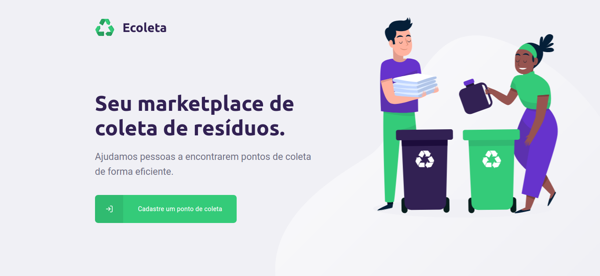
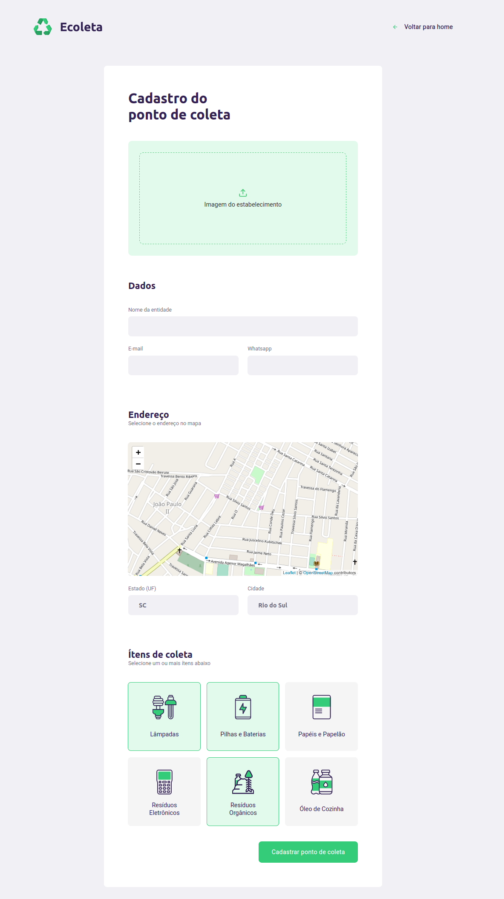
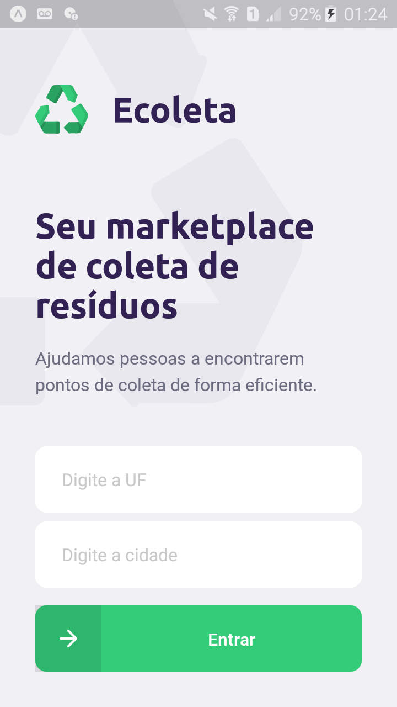
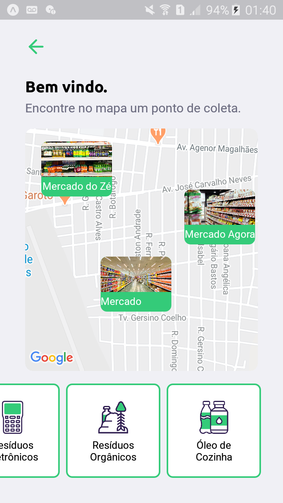
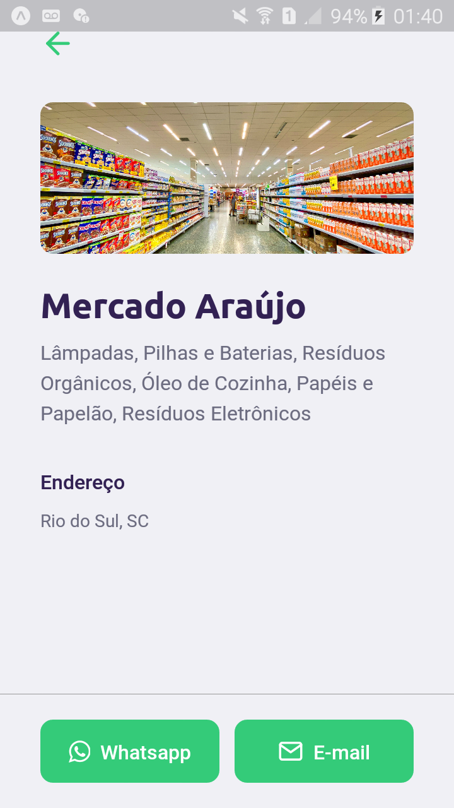

# NLW

Aplicação desenvolvida durante o evento Next Level Week da Rocketseat.
Ecoleta é um projeto que visa ajudar pessoas a encontrarem pontos de coleta de resíduos de forma eficiente.

Na aplicação web, donos de estabelecimentos podem cadastrar informações como localização, email, número de contato e tipos de resíduos que estão recebendo.

No app mobile, o usuário consegue filtrar os estabelecimentos por estado, cidade e resíduos. Ao selecionar uma das localizações exibidas no mapa, o usuário pode entrar em contato com o estabelecimento através de email ou whatsapp.

# Web

  

  

# Mobile

  
  
  

# Funcionalidades
## Web
 - Cadastro de estabelecimentos por localização e resíduos coletados.

## Mobile
 - Listagem dos estabelecimentos cadastrados.
 - Envio de mensagem por Whatsapp ou email.

# Principais Tecnologias
 - Node.js
 - ReactJS
 - React Native
 - Expo
 - SQLite 
 - Knex
 - Cors
 - Celebrate